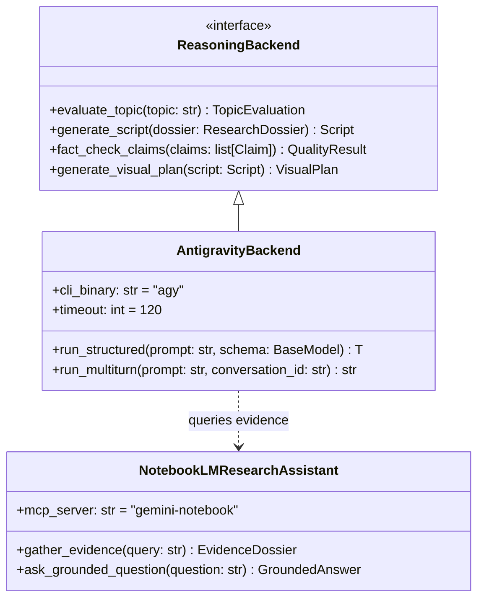

# Antigravity Runtime & Reasoning Plane Specification

## 1. Executive Summary

This document establishes the architecture and empirical verification of Google Antigravity as the primary control plane, reasoning engine, and orchestration environment for **YouTube Autopilot**. In accordance with core engineering rules, commercial external LLM API endpoints (such as raw Gemini Developer API wrappers) are completely eliminated from core reasoning paths in favor of the local Antigravity runtime, SDK, and specialized MCP connectors.

---

## 2. Runtime Capability Classification

Based on live runtime spikes executed in `experiments/antigravity_runtime/`, the Antigravity runtime capabilities are classified as follows:

| Capability | Classification | Empirical Evidence |
|---|---|---|
| **Programmatic Execution** | `SUPPORTED` | Python `google.antigravity` (v0.1.12) imported cleanly; `Agent`, `LocalAgentConfig`, `CapabilitiesConfig` exported. |
| **Headless CLI Execution** | `SUPPORTED` | `agy --print "<prompt>" --output-format json` executed non-interactively with Exit Code 0 in ~11s. |
| **Structured Output** | `SUPPORTED` | `--json-schema` enforces strict JSON schemas validated directly into Pydantic models with typed fields. |
| **Multi-Turn Context Continuity** | `SUPPORTED` | Context retained across turns via `--conversation <conversation_id>` (retained secret code across isolated turns). |
| **MCP Integration** | `SUPPORTED` | Native MCP client interfaces with `gemini-notebook` (`get_health`, `get_capabilities`, `ask_question`). |
| **Subagent Hierarchy** | `SUPPORTED` | Antigravity native subagent spawning and delegation supported for parallel task isolation. |
| **Scheduler Integration** | `SUPPORTED` | Cron and one-shot timers supported via native scheduling primitives. |

---

## 3. Architecture Decision: ReasoningBackend



### Invariant Rules
1. **Primary Control Plane**: `AntigravityBackend` executes via headless CLI / SDK subprocess with strictly enforced Pydantic schemas.
2. **NotebookLM Role**: Dedicated exclusively as a **Research Evidence Assistant** for Stage 1 (Research), Stage 2 (Topic Selection), and Stage 3 (Evidence Gathering). NotebookLM is NOT a video renderer, TTS synthesizer, or primary orchestrator.
3. **Fail-Safe Discipline**: Any backend failure produces an explicit `FAILED` or `BLOCKED` state with full error diagnostics. No silent mock fallbacks.

---

## 4. Spike Verification Evidence

### 4.1. Import & Symbol Export
- **Script**: `experiments/antigravity_runtime/spike_test.py`
- **Output**:
  ```
  IMPORT_STATUS: SUCCESS
  EXPORTED_SYMBOLS: ['Agent', 'AgentBehavior', 'AgentConfig', 'CapabilitiesConfig', 'LocalAgentConfig', ...]
  ```

### 4.2. Schema-Enforced Structured Output
- **Script**: `experiments/antigravity_runtime/test_comprehensive_runtime.py`
- **Input Model**: `TopicEvaluation(topic: str, target_audience: str, viability_score: int, key_reasons: list[str])`
- **Execution Result**:
  - Exit Code: `0`
  - Validated Model: `TopicEvaluation(topic='How to build local AI agents in Python', viability_score=9, ...)`

### 4.3. Multi-Turn Context Memory
- **Turn 1 Prompt**: `"Remember this secret code: 'YOUTUBE_AUTOPILOT_2026'"` $\rightarrow$ Returned `conversation_id = 7a75e662-266e-4a04-ae5f-a51969498430`
- **Turn 2 Prompt**: `"What was the secret code I gave you?"` (using `--conversation 7a75e662-266e-4a04-ae5f-a51969498430`)
- **Turn 2 Output**: `"The secret code you gave me is: YOUTUBE_AUTOPILOT_2026"`
- **Memory Continuity**: `True`

### 4.4. NotebookLM MCP Grounded Evidence Query
- **Tool**: `gemini-notebook:ask_question`
- **Provenance**: `{"provider": "google-gemini-notebook", "grounding": "user-uploaded-documents", "ai_generated": true}`
- **Result**: Successfully extracted structured multi-format video synthesis taxonomy directly from grounded sources.
