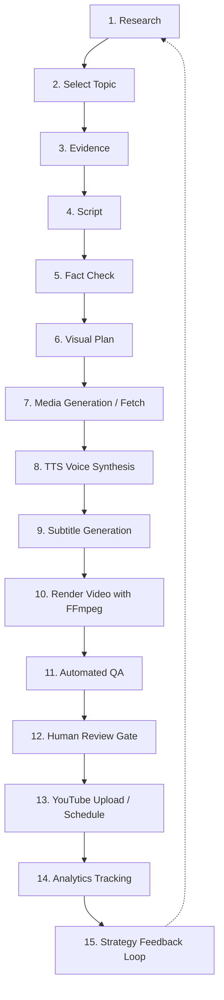

# YouTube Autopilot — Project Engineering Contract

## 1. Executive Summary

YouTube Autopilot is an automated video research, generation, rendering, publishing, and analytics orchestration system. The system uses Antigravity as its primary control plane and reasoning environment, enforcing strict verification, copyright protection, media provenance, and human-in-the-loop approval.

---

## 2. Pipeline Lifecycle

The system operates across 15 well-defined stages:

### Stage Definitions

1. **Research**: Gathers trend signals, niche search demand, audience interest, and candidate topics.
2. **Select Topic**: Evaluates opportunity, authority, and video viability to select a high-potential topic.
3. **Evidence**: Compiles verified source material, citations, and data points supporting the topic.
4. **Script**: Generates a structured narrative, hooks, body sections, transitions, and calls-to-action.
5. **Fact Check**: Cross-verifies claims, numbers, dates, and names against compiled evidence.
6. **Visual Plan**: Produces a scene-by-scene storyboard, shot lists, layout templates, and timing markers.
7. **Media**: Acquires or generates visual assets (images, video clips, animations) with complete provenance tracking.
8. **TTS**: Synthesizes synchronized narration audio files using configured speech engines.
9. **Subtitle**: Generates precise word/sentence-level subtitle tracks (.srt, .vtt, or burned ass/ass-styles).
10. **Render**: Assembles audio, video, B-roll, overlays, transitions, and subtitles into master video via FFmpeg.
11. **QA**: Validates video duration, audio-video sync, loudness/LUFS levels, frame drops, and resolution.
12. **Human Review**: Mandatory checkpoint presenting draft video, metadata, and QA report to a human operator.
13. **YouTube Upload/Schedule**: Authenticates with YouTube Data API v3 and uploads video with default `private` status.
14. **Analytics**: Pulls views, watch time, CTR, retention curves, and engagement via YouTube Analytics API.
15. **Strategy Feedback**: Synthesizes performance insights to tune future research and topic selection.

---

## 3. Architecture & Reasoning Plane

### Control Plane
- **Primary Environment**: Antigravity runtime, SDK, and specialized agents.
- **Backend Priority**:
  1. Antigravity runtime / SDK
  2. Antigravity agents
  3. Model Context Protocol (MCP) servers
  4. Dedicated external APIs only when strictly necessary
- **Reasoning Backend Prohibition**: Gemini Developer API (and raw commercial LLM endpoints) must NOT be used as the default reasoning backend for core cognitive tasks (research, topic selection, scriptwriting, fact checking, QA, metadata, analytics).

### YouTube External APIs
- **YouTube Data API v3**: Required for metadata upload, thumbnail setting, playlist management, and scheduling.
- **YouTube Analytics & Reporting API**: Required for metrics ingestion and performance feedback.

---

## 4. Execution State Discipline

Every execution result across services, tasks, and CLI commands must be explicitly typed:

| State | Definition | Permitted in Production |
|---|---|---|
| `REAL` | Live execution with real external effects and data mutations | Yes |
| `TEST` | Test execution isolated with approved mocks/fixtures | Tests Only |
| `DRY_RUN` | Simulation validating inputs, logic, and schemas without mutation | Yes |
| `BLOCKED` | Awaiting missing inputs, validation criteria, or human approval | Yes |
| `FAILED` | Process error with diagnostic trace and exit code != 0 | No (Terminates) |

> **Anti-Masking Invariant**: Catching a runtime error and substituting a placeholder dummy value to emit `SUCCESS` is strictly prohibited.

---

## 5. Security, Copyright & Provenance

1. **Anti-Plagiarism**: Under no circumstances will content from existing YouTube videos or copyrighted third-party media be ripped, duplicated, or reuploaded without transformative license and explicit rights.
2. **Asset Provenance Record**: Every external asset stored in `data/` or compiled into `output/` must include:
   - Source URL / URI
   - Acquisition timestamp
   - License type / usage terms
   - Content SHA-256 hash
3. **Upload Privacy Safeguard**:
   - Default privacy on upload is always `private`.
   - Transitioning an asset to `unlisted` or `public` requires explicit human confirmation.

---

## 6. Persistence & Rendering Standard

1. **Database**: Local SQLite database is the primary local persistence tier. PostgreSQL is supported as an optional production backend.
2. **Rendering Engine**: FFmpeg is the definitive video and audio composition tool.
3. **Configuration**: Environment configurations are loaded from `.env` using standard configuration loaders. No hardcoded credentials.
